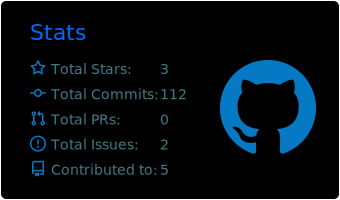
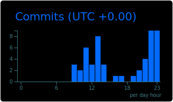
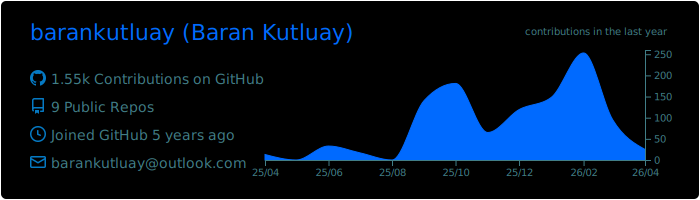
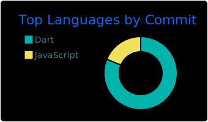
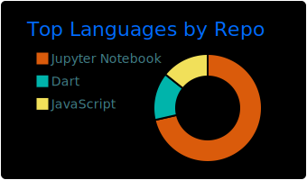

# Hi there, I'm Baran! 👋

### 🚀 Mobile Developer & AI Enthusiast

I specialize in building scalable **mobile applications** with **Flutter** and enhancing them with **AI/Data Science** solutions. My expertise bridges the gap between fluid mobile UI and powerful backend intelligence.

- 🔭 I’m currently working on **AI-powered mobile architectures.**
- 💼 I specialize in **Flutter, Firebase, and Python Automation.**
- 🌱 I’m currently exploring **Advanced Computer Vision techniques.**
- 💬 Ask me about **Mobile State Management, Bot Automation, or AI Model Deployment.**

---

### 🛠️ Technical Expertise

**📱 Mobile Development**
 

**🤖 AI, Data Science & Computer Vision**
 

**⚙️ Backend, Automation & Tools**
 

**📊 Business Intelligence & Management**
 

---

### 📊 Analytics Dashboard

  <a href="https://github.com/barankutluay">
    <picture>
      <source media="(prefers-color-scheme: dark)" srcset="https://github-readme-stats.vercel.app/api?username=barankutluay&show_icons=true&theme=transparent&hide_border=true&count_private=true">
      <source media="(prefers-color-scheme: light)" srcset="https://github-readme-stats.vercel.app/api?username=barankutluay&show_icons=true&theme=transparent&hide_border=true&count_private=true">
      
    </picture>
  </a>

  <a href="https://github.com/barankutluay">
    <picture>
      <source media="(prefers-color-scheme: dark)" srcset="https://github-readme-stats.vercel.app/api/top-langs/?username=barankutluay&layout=compact&theme=transparent&hide_border=true&hide=jupyter%20notebook">
      <source media="(prefers-color-scheme: light)" srcset="https://github-readme-stats.vercel.app/api/top-langs/?username=barankutluay&layout=compact&theme=transparent&hide_border=true&hide=jupyter%20notebook">
      
    </picture>
  </a>

   

  <a href="https://github.com/barankutluay">
    <picture>
      <source media="(prefers-color-scheme: dark)" srcset="https://nirzak-streak-stats.vercel.app/?user=barankutluay&theme=transparent&hide_border=true">
      <source media="(prefers-color-scheme: light)" srcset="https://nirzak-streak-stats.vercel.app/?user=barankutluay&theme=transparent&hide_border=true">
      
    </picture>
  </a>

  

   

  

  

   

  

  

---

  

